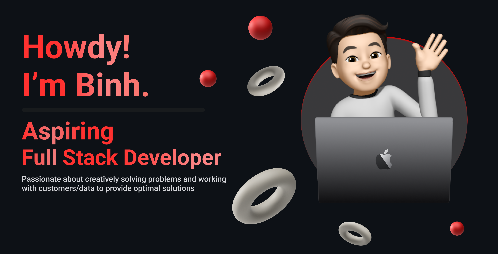

  

  
  

## My name is Binh Do-Cao

I graduated from Texas A&M University with a Computer Science degree in December of 2023. I am an aspiring Full-Stack developer and would love to work on something that is going to make a big difference in the world. In my free time, I love photography, staying up to date on the latest tech gadgets, and working out!
  

- 🔭 I’m currently working on mobile app development and integrating machine learning into my projects.
  

- 🌱 I’m currently learning Swift, Javascript, and various Machine Learning packages.
  

   

## Connect with me  

  
  

  

## Tech Stack 
                     

## Github Stats 

 
 

---

  
  

   

            

 

----  
<!-- Proudly created with GPRM ( https://gprm.itsvg.in ) -->
